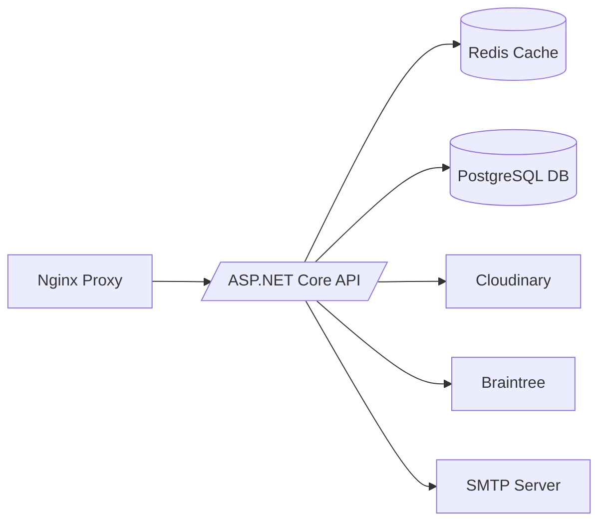

# BookTheRoom

**Fullstack booking web-service made by Max Sheludchenko**

Service provides booking rooms in hotels and private apartments owned by users.

---

## Technologies Used

### Backend (Clean Architecture / DDD)
- **ASP.NET Core & C# (.NET 8)**
- **Docker & Docker Compose**
- **Redis** (distributed cache)
- **PostgreSQL**
- **Braintree** (payment service, sandbox)
- **Cloudinary** (media file storage)
- **MimeKit** (SMTP email)
- **MediatR** (CQRS pipelines)
- **FluentValidation**
- **EntityFramework Core & Identity**
- **JWT Bearer Authentication**

### Frontend
- **React 18.3.1 & Node.js 16.14.0**
- **Tailwind CSS**
- **Axios**
- **Chakra UI**
- **FontAwesome**
- **yet-another-react-lightbox**
- **slick-carousel**
- **js-cookie**

---

## Architecture Overview

The system consists of:

- **Web Server:** Nginx (reverse proxy to the API)
- **Application Server:** ASP.NET Core (Kestrel) in Docker
- **Database:** PostgreSQL
- **Cache:** Redis
- **File Storage:** Cloudinary (external)
- **Other Services:** Braintree (payments), SMTP mail server



> If your project omits any component or differs, coordinate with the instructor.

---

## Developer Setup

Follow these steps on a fresh machine:

1. **Prerequisites**
   - **OS:** Windows 10/11, Ubuntu 20.04+, or macOS
   - **Git**
   - **.NET 8 SDK**
   - **Node.js 16.x & npm**
   - **Docker & Docker Compose**

2. **Clone the repository**
   ```bash
   git clone https://github.com/xpertOfRock/BookTheRoom.git
   cd BookTheRoom
   ```

3. **Environment variables**
   ```bash
   cp .env .env.local
   # Edit .env.local to verify credentials and ports
   ```

4. **Install dependencies**
   - **Backend**
     ```bash
     cd Api
     dotnet restore
     ```
   - **Frontend**
     ```bash
     cd ../ClientApp
     npm install
     ```

5. **Database & Cache**
   ```bash
   docker-compose up -d booktheroomdb distributedcache
   cd Api
   dotnet ef database update
   ```

6. **Run in dev mode**
   - **Backend**
     ```bash
     cd Api
     dotnet run --urls http://localhost:8080
     ```
   - **Frontend**
     ```bash
     cd ../ClientApp
     npm start
     ```

Alternatively:
```bash
docker-compose -f docker-compose.yml -f docker-compose.override.yml up --build
```

**Common Commands**
- `dotnet ef migrations add <Name>` – add a migration
- `dotnet ef database update`    – apply migrations
- `npm run build`               – build frontend
- `docker-compose up -d`        – start all services

---

## Production Deployment

Use the following steps to deploy into production:

1. **Hardware Requirements**
   - **CPU:** x64, ≥4 cores
   - **Memory:** ≥8 GB RAM
   - **Disk:** ≥50 GB SSD
   - **Network:** 1 Gbps

2. **Software Prerequisites**
   - **Docker Engine & Compose**
   - **.NET 8 Runtime**
   - **Node.js 16.x** (for static asset build)
   - **Nginx**

3. **Network Configuration**
   - Open ports **80** (HTTP) and **443** (HTTPS)
   - Configure DNS to point to the server's public IP

4. **Server Configuration**
   - Install Docker and Docker Compose
   - Configure system user for running containers
   - Install Nginx and set up reverse proxy to `http://localhost:8080`

5. **Database Setup**
   - Start PostgreSQL container or service
   - Secure DB credentials
   - Run migrations: `dotnet ef database update`

6. **Code Deployment**
   ```bash
   git pull origin main
   docker-compose pull
   docker-compose up -d --build
   ```

7. **Health Check**
   - Verify `https://your-domain.com/health` returns 200
   - Check logs: `docker-compose logs api`
   - Confirm DB connectivity

---

## Update Procedure

To perform a safe update:

1. **Preparation**
   - Review changelog and release notes
   - Test on staging environment

2. **Backups**
   ```bash
   pg_dump -U postgres BookTheRoomDb > backup.sql
   tar czf media_backup.tar.gz ./media
   ```

3. **Compatibility Check**
   - Verify schema changes
   - Ensure API contract stability

4. **Downtime Planning**
   - Schedule maintenance window
   - Notify stakeholders

5. **Stop Services**
   ```bash
   docker-compose down
   ```

6. **Deploy New Code**
   ```bash
   git pull origin main
   docker-compose up -d --build
   ```

7. **Run Migrations**
   ```bash
   docker-compose exec api dotnet ef database update
   ```

8. **Update Configuration**
   - Check `.env` or environment variables
   - Restart containers if changed

9. **Post-Update Verification**
   - Hit health endpoints
   - Review logs for errors

---

## Rollback Procedure

If the update fails or critical errors occur:

1. **Assess failure** and decide to rollback quickly
2. **Stop current services**
   ```bash
   docker-compose down
   ```
3. **Restore database**
   ```bash
   psql -U postgres BookTheRoomDb < backup.sql
   ```

4. **Checkout previous code**
   ```bash
   git checkout <previous-tag>
   docker-compose up -d --build
   ```
5. **Verify**
   - Health endpoint
   - Basic functionality

---